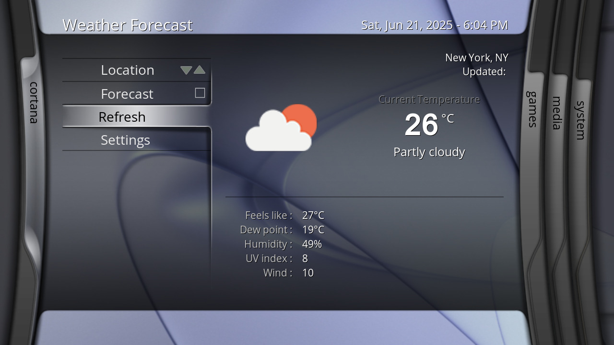
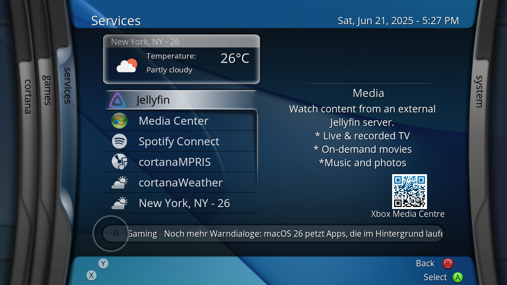

# plugin.weather.wttrin
Functional weather plugin for XBMC4Xbox/XBMC4Gamers using wttr.in's backend.

## How to use:
- Download latest release .zip
- Copy the "weather.wttrin" folder to Q:/plugins/weather
- Go to Q:/UserData/advancedsettings.xml and add the following entries (replace the city names with the 3 cities you'd like to cycle between)

<pre><code>
&lt;weather&gt;
    &lt;areacode1&gt;Toronto, ON&lt;/areacode1&gt;
    &lt;areacode2&gt;New York City, NY&lt;/areacode2&gt;
    &lt;areacode3&gt;Tokyo, Japan&lt;/areacode3&gt;
    &lt;plugin&gt;weather.wttrin&lt;/plugin&gt;
&lt;/weather&gt;
</code></pre>

  - Open your Weather Settings, and set the default Weather service to "weather.wttrin"
  - After that, you should be set! Weather should function exactly how it used to in older versions.

  ## TODO:
  - Do more Fahrenheit testing (has only been tested in celcius / kmh!)
  - Improve response times somewhat
